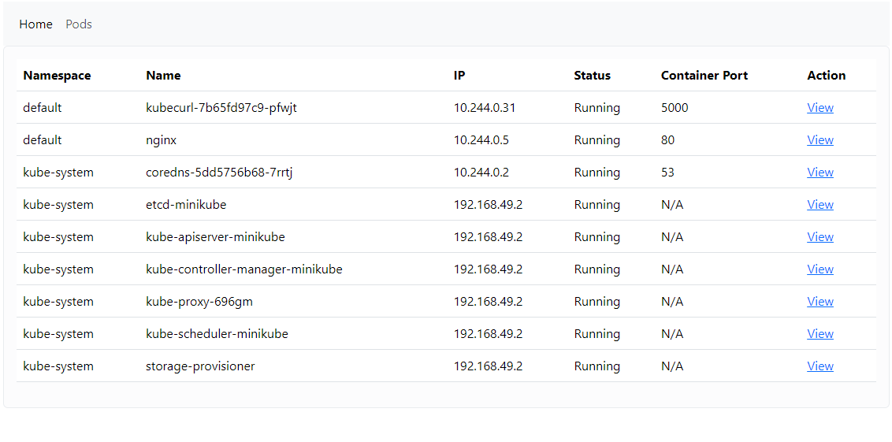
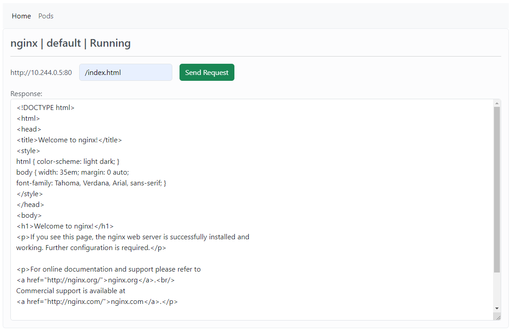

kubecurl
https://hub.docker.com/repository/docker/lanceapps/kubecurl

**Docker Installation**
```bash
  docker pull lanceapps/kubecurl
```
**Kubernetes Installation**
```bash
  #Download first the kubecurl-loadbalancer.yaml or copy/paste the contents to a local file 
  kubectl apply -f kubecurl-loadbalancer.yaml
```

**AWS EKS Fargate Installation**
```bash
  #Download first the kubecurl-fargate.yaml or copy/paste the contents to a local file 
  kubectl apply -f kubecurl-fargate.yaml
```

**Use Case Details:**

- In some cases, if you have multi container service behind ingress resource which is being load balanced but you may want to directly send a curl to a selected pod/container for troubleshooting purposes such as returning if the data is correct.
- Kubernetes by default wont be able to point the traffic to only the container you want unless you configure some logics to have that so.
- In production environment, the load balancing cannot be changed or replaced on the fly because of availability concerns. To easily curl to running pods to find out which one is returning error, this simple console allows you to directly send http request to it to verify the return data is correct.


A simple Flask application to send http requests to detected pods in Kubernetes cluster using http://{pod-ip-address}:{pod-port}/<$uri>

**Notice!**

- This is for internal usage only.
- It is recommended to have a separate nodeport service or loadbalancer directly to this service. 
- Configure Public/Private IP Source Whitelisting at the load balancer side to ensure selected resources can only access it. E.g. an internal jump server or administrator's machine. 

The http request is sent directly to the pod internally in the Kubernetes cluster using curl:

**curl -s -X GET {full_url}**



